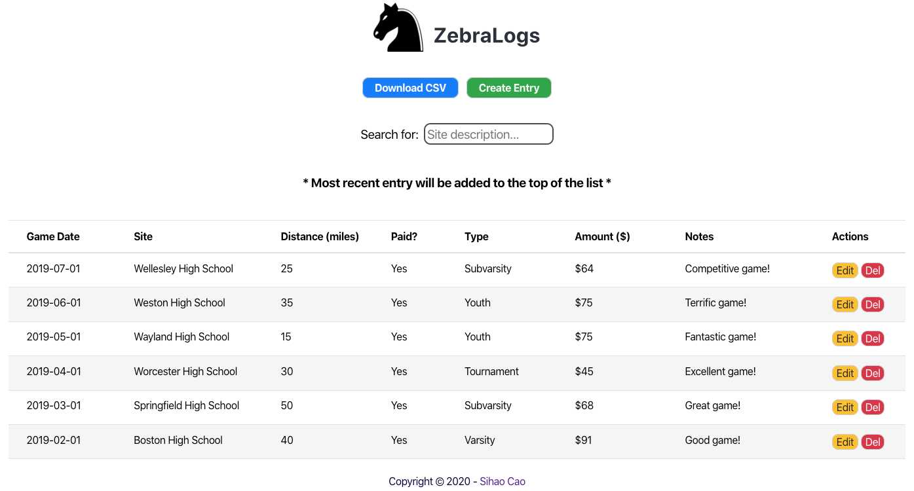

# Zebralogs -- web application
* Zebralogs allows any sports official to track one's contest information along with the ability to export the list of entries.

## App Description
* Zebralogs is a full-stack web app built with React, CSS, Node, Express, and Postgresql. This website does not use any third-party API. This website is supported on Chrome, Firefox, and Safari. This app is a fully responsive website.

## Client-side Code
* [ZebraLogs Client](https://github.com/sihaocao/zebralog-client)

## Built with
* Node
* Express
* PostgreSQL

## Endpoints
### /zebralogs
* `GET /api/zebralogs`

Returns an array of entries.

* `GET /api/zebralogs/:zebralog_id`

Returns an entry whose id matches `:zebralog_id`.

* `POST /api/zebralogs`

Verifies input and adds a new entry to the database if valid.

* `PATCH /api/zebralogs/:zebralog_id`

Updates input of an existing entry if valid.

* `DELETE /api/zebralogs/:zebralog_id`

Deletes an entry from the database.

## Setting Up
* Install dependencies: `npm install`
* Create development and test databases: `createdb zebralogs`, `createdb zebralogs-test`
* Create database user: `createuser zebralogs_user`
* Bootstrap development database: `zebralogs npm run migrate`
* Bootstrap test database: `zebralogs-test npm run migrate`

## Sample Data
* To seed the database for development: `psql -U zebralogs_user -d zebralogs -f seeds/seed.zebralog.sql`
* To clear seed data: `psql -U zebralogs_user -d zebralogs -f seeds/trunc.zebralog.sql`

## Scripts
* Start application for development: `npm run dev`
* Run tests: `npm test`